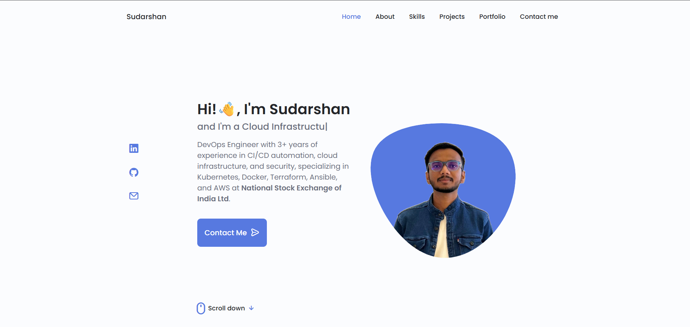
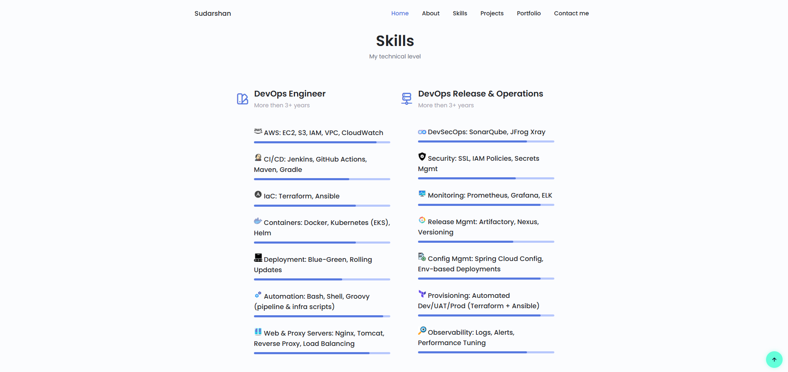

# 🌐 Personal Portfolio — Sudarshan Gawande

A modern, responsive portfolio highlighting my experience as a **DevOps Engineer** with expertise in **AWS, CI/CD, Kubernetes, Terraform, DevSecOps, and automation**.  
This portfolio showcases my skills, projects, certifications, and professional journey.

🔗 **Live Website:** https://sudarshangawande.com  
🔗 **GitHub Repo:** https://github.com/sudarshan-gawande

---

## 🚀 Tech Stack

| Category | Tools |
|----------|-------|
| **Frontend** | HTML5, CSS3, JavaScript|
| **Hosting** | GitHub Pages / Netlify / AWS S3 |
| **DevOps Branding** | AWS, Terraform, Jenkins, Kubernetes, Docker, Prometheus, Grafana |

---

## 📌 Website Preview

### **Homepage**


### **Skills Section**


---

## 🛠 Features

- 🏗 **Fully Responsive**
- ⚡ **Fast & Lightweight**
- 🎨 **Modern UI with icons**
- 🛡 **DevOps-focused skill layout**
- 🧩 **Modular structure for easy updates**

---

## 📂 Folder Structure

```bash
.
├── index.html
├── assets/
│   ├── css/
│   ├── img/
│   ├── icons/
│   └── js/
├── README.md
└── LICENSE
```

---

## 🔧 Setup & Deployment

### **Clone the repo**
```bash
git clone https://github.com/sudarshan-gawande/my-portfolio.git
cd my-portfolio
```

### **Run locally**
Just open `index.html` in browser.

### **Deploy to GitHub Pages**
```bash
git add .
git commit -m "Initial commit"
git push
```

Then enable Pages under:  
`Settings → Pages → Deploy from main → /root`

---

## 🏆 Highlights

- Built with **clean semantic HTML**
- Structured for **ATS-friendly developer branding**
- Contains **production-quality DevOps skill presentation**
- Designed to be **extensible for blog, certifications, and analytics**

---

## 📧 Contact

**Sudarshan Gawande**  
📍 Mumbai, India  
📩 Email: sudarshangawande98@gmail.com  
🔗 LinkedIn: https://linkedin.com/in/sudarshan-gawande  
🔗 Portfolio: https://sudarshangawande.com

---

## ⭐ Contribute

If you'd like to enhance the UI or performance:

```bash
Fork → Commit → Pull Request
```

---

## 📝 License

MIT License © 2025 Sudarshan Gawande
